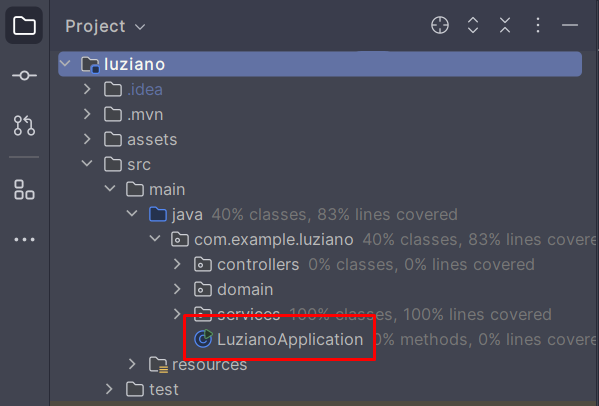
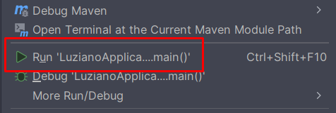
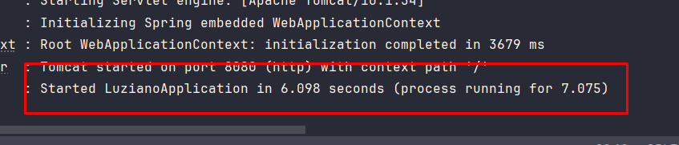
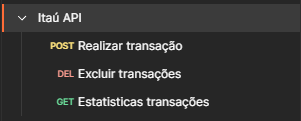
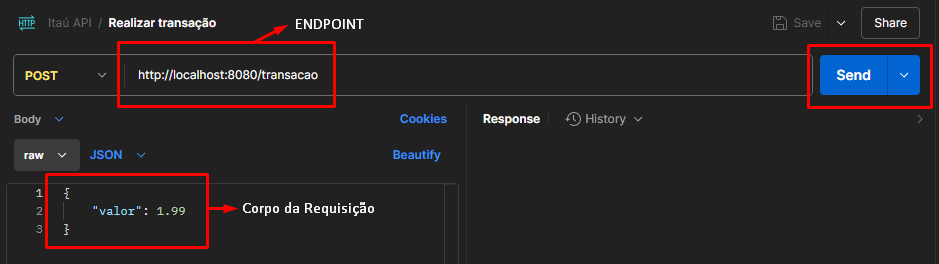
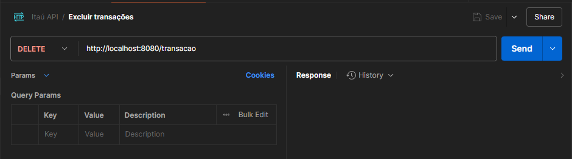
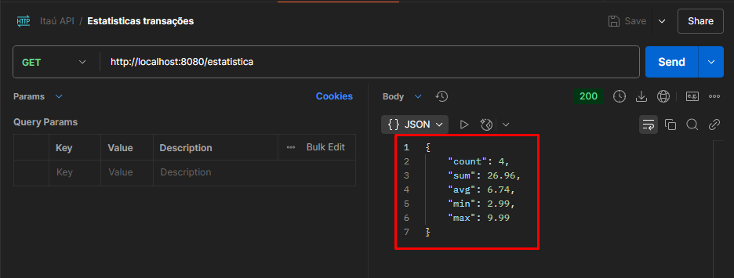

# **Itaú - Desafio de Programação**

## Sobre o projeto:

Esta é uma API capaz de realizar, excluir e obter estatísticas sobre
transações em memória feitas pelo usuário, seguindo as regras do 
**[Desafio Itaú Vaga 99 Junior](https://github.com/rafaellins-itau/desafio-itau-vaga-99-junior/tree/main?tab=readme-ov-file)**.

## Tecnologias:

- **Java (17)**
- **Spring (3.4.2)**
- **Lombok (1.18.28)**
- **Git**

## Ferramentas de Desenvolvimento:

- **Intellij**
- **Spring Initializr**
- **GitHub**
- **Postman**

## Como rodar o projeto:

Primeiramente, garanta que você tenha instalado o [Intellij](https://www.youtube.com/watch?v=YKHM_DUOV0k&ab_channel=StackMobile) (ou alguma IDE de sua preferência),
[Java 17](https://www.youtube.com/watch?v=uwqJu2I0Nnk&ab_channel=GPot) ou superior,
o [Git](https://www.youtube.com/watch?v=Am46OOLgV4s&ab_channel=CryswertonSilva),
e o [Postman](https://www.youtube.com/watch?v=RK2ZIuAd8_I&ab_channel=RaphaTechDicas).

Após isso, é preciso clonar este projeto para a sua máquina. Para isso, vá até uma pasta (de sua preferência),
[abra o cmd](https://www.youtube.com/watch?v=KUamvXZDwq8&ab_channel=FelipeEliasSilva)
e execute o seguinte comando:

~~~
git clone https://github.com/arthurluziano/api-estudo-java.git
~~~

Feito isso, vamos [abrir esse projeto no Intellij](https://www.youtube.com/watch?v=aY1FSlcGClE&ab_channel=DanielAmaral).  
Deixe-o aberto por alguns minutos para que o Intellij consiga configurá-lo corretamente.

### 1. Iniciando a aplicação

Agora iremos iniciar a nossa aplicação, para isso abra as pastas ***src > main > java > com.example.luziano*** e clique com o botão direito em
**LuzianoApplication**. Segue o exemplo abaixo:

Procure e execute a seguinte opção:

A aplicação estará rodando assim que aparecer a seguinte mensagem no console:

### 2. Realizando requisições

O Postman é uma ferramenta de desenvolvimento comumente utilizada por desenvolvedores para relizar
requisições e testar sua aplicação.

Para podermos testar cada endpoint, faremos o import dessa [Collection](assets/itau-api.json) no Postman. Caso você não saiba,
assista o seguinte [tutorial](https://www.youtube.com/watch?v=M-qHvBhULes&ab_channel=Testfully).

Após importar a Collection mencionada anteriormente, verifique se sua aplicação está [rodando](#1-iniciando-a-aplicação) 
e vamos começar:

1. <h4>POST /transacao</h4> 
   A primeira requisição se trata do método **POST**, o que significa que ela recebe um corpo para realizar a requisição.
   
   

   Ao clicar em **Send** você estará chamando a API, que fará uma "transação" que será salva apenas em memória.

2. <h4>DELETE /transacao</h4>
   A segunda requisição, apesar de ter o mesmo nome da primeira, é do método **DELETE**. Ela
   é responsável por excluir todas as transações em memória da aplicação.

   

3. <h4>GET /estatistica</h4>
   A terceira, e última, requisição se trata do método **GET**. Ela nos retorna informações
   sobre todas as transações feitas no último minuto.

   

### 3. Implementações futuras:

- Sistema de autenticação JWT...
- Implementação Swagger...